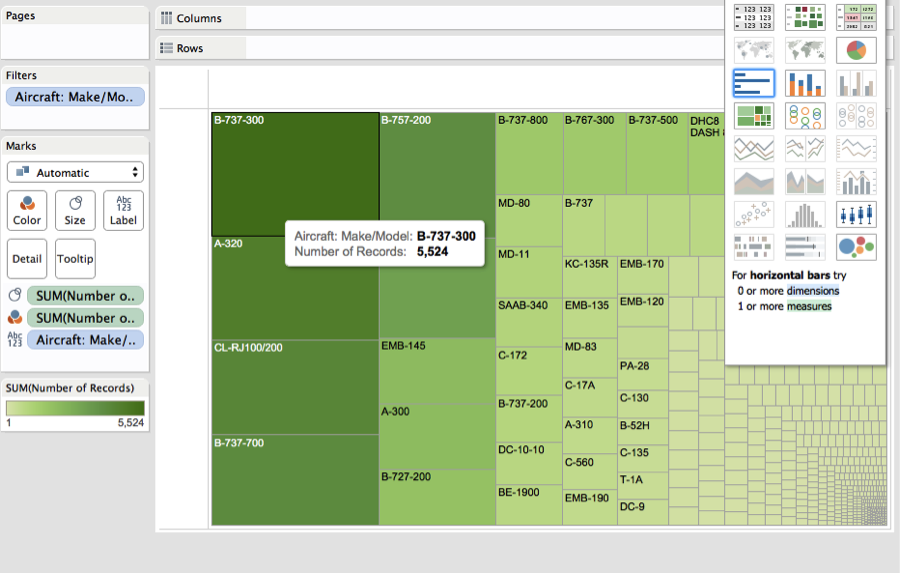

# Report

Using Tableau, create visualization for each question in the report regarding
bird strikes.

# Authors

This report is prepared by
* [Full name](link to github account)
* [Full name](link to github account)
* [Full name](link to github account)
* [Full name](link to github account)
* [Full name](link to github account)

# (Question 1)

WHich airport has the most bird hits?

# Which aircraft tyope had the most bird hits? 

    to see the answer)

#  Which species causes the most bird hits?

This question was asked by (student's github id).

# What is the geo distribution of bird strikes?

(write your explanation for the reader as to where to look at this chart in order
    to see the answer)

# (Question 5)

This question was asked by (student's github id).

(write your explanation for the reader as to where to look at this chart in order
    to see the answer)    
