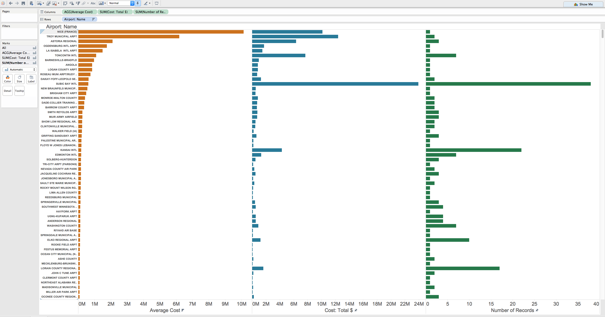
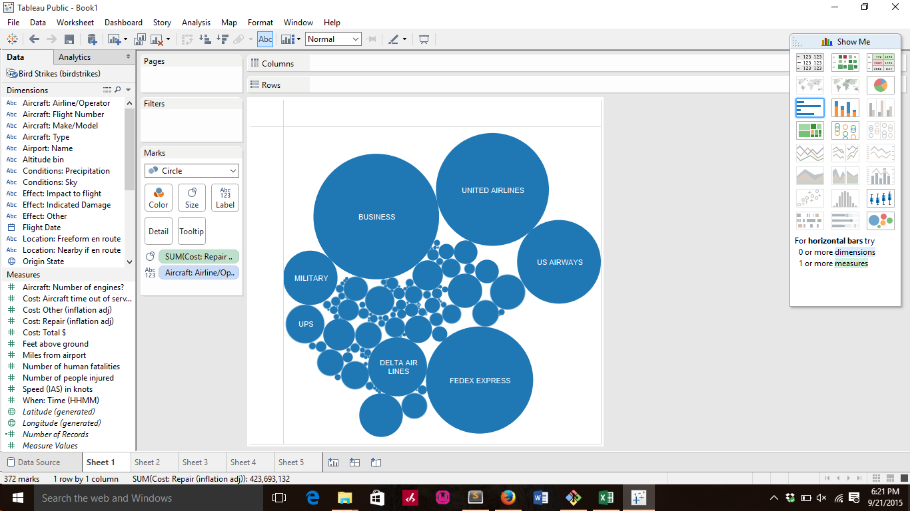




# Report

Using Tableau, create visualization for each question in the report regarding
bird strikes.

# Authors

This report is prepared by
* [Brian McKean](http://co-bri.github.io/book)
* [Karen Blakemore](https://github.com/kjblakemore)
* [Ming Leiw](link to github account)
* [Matt Schroeder](link to github account)
* [Dian](link to github account)

# Which airport has the most bird hits? by zhya215 


names = _.filter(data,function(n){
	return n["Airport: Name"] != "UNKNOWN"
})

airports = _.groupBy(names,function(n){
        return n["Airport: Name"]
})
var incidents  = _.mapValues(airports,function(n){
        return  n.length
})

big = _.max(incidents)
most = _.pick(incidents,function(n){
	return n == big
})
return most



	The worse airport is {{key}} with {{value}} incidents


 
The bubble are set by size showing Denver with most bird strike incident reports

# What airports have the most expensive average accident?

This question was asked by (https://github.com/kjblakemore).

The leftmost barchart in orange shows the airports with the most expensive average.

# Which airline have to incur most repair cost due to damage ? ( sumi6109)

# Which aircraft type had the most bird hits? 

#  Which species causes the most bird hits?

# What is the geo distribution of bird strikes?

