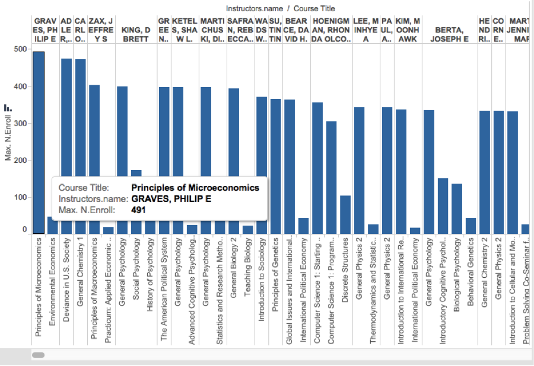
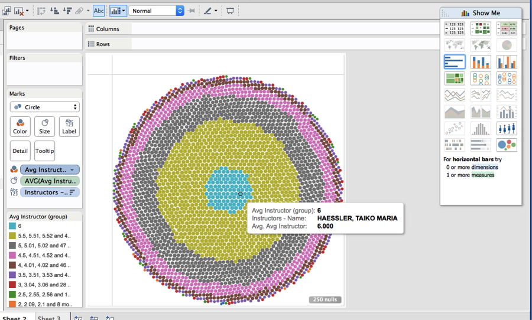




# Report

As a class, we brainstormed and came up with a long list of further questions we
can ask based on the FCQ data. Out of these questions, our team chose to tackle on
the following questions. Each member on our team is reponsible for one question.

# How many courses in IPHY that has 4 credits hours ? by Fadhil


var iphy = _.filter(data,function(n){
        return n.CrsPBADept == 'IPHY'
})
var fours = _.filter(iphy,function(n){
	return n.Hours == 4
})
var fours = fours.length
	
return  fours


There are {{result}} courses in IPHY with 4 credit hours

# Which are the top 5 departments in terms of number of 4000 level classes? 
# by Brian 


var groups = _.groupBy(data,function(n){
        return n.Subject
})
var subject4k = _.mapValues(groups,function(n){ 
	var  classLvl = _.pluck(n,"CrsLvlNum")
	classes4k = _.filter(classLvl,function(n){
		return n == "4XXX"
	})
        return  classes4k.length
})
var sort4k = _.sortBy(subject4k, function(n,key){
	return n
})
// Problem is the the sort removed the keys
// so use the sort to find the 5th highest vailue
// then go back to dictionary and pull the ones that size or larger
var cutoff = sort4k[sort4k.length-5]
var top54k = _.pick(subject4k,function(n){
	return n >= cutoff
})
var result = top54k
return result


<table>

    <tr>
        <td>{{key}}</td>
        <td>{{value}}</td>
    </tr>

</table>

# Which instructors course has the highest enrollment?
# by Zhili


var groups = _.groupBy(data,function(n){
	return n.Instructors[0].name
})
var enrolls = _.pluck(data,"N.ENROLL")
var biggest = _.max(enrolls)
var bigClass = _.pick(data,_.matchesProperty('N.ENROLL',biggest))

var prof =  _.pluck(bigClass, "Instructors")
var prof = _.pluck(prof[0],'name')
return prof


The instructor of the course with the highest enrollment is {{result}}

#  Which department has the highest enrollment? By Tristan



var groups = _.groupBy(data,function(n){
        return n.Subject
})
var enrollments = _.mapValues(groups,function(n){
	var enrollArray = _.pluck(n,'N.ENROLL')
	var sum = _.sum(enrollArray)
	return sum
})
var numbers = _.max(enrollments)
var bigDept = _.findKey(enrollments,function(n){
	return n >= numbers
})
return bigDept

return "answer"

The department with the biggest enrollment is {{result}}

#  What instructors has the highest rating? By Andrew


var groups = _.groupBy(data,function(n){
	return n.Instructors[0].name
})
var ratings = _.pluck(data,"AvgInstructor")
var best = _.max(ratings)
var bestProf = _.pick(data,_.matchesProperty('AvgInstructor',best))

var prof =  _.pluck(bestProf, "Instructors")
prof = _.flatten(prof)
var prof = _.pluck(prof,'name')
return prof


The instructors with the highest rating are

<table>

    <tr>
        <td>{{x}}</td>
    </tr>

</table>

