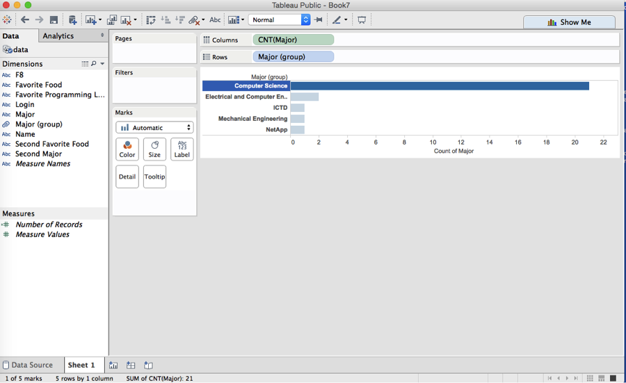
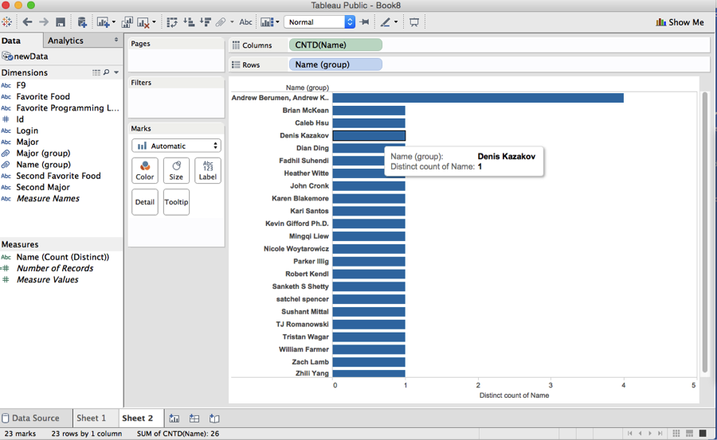
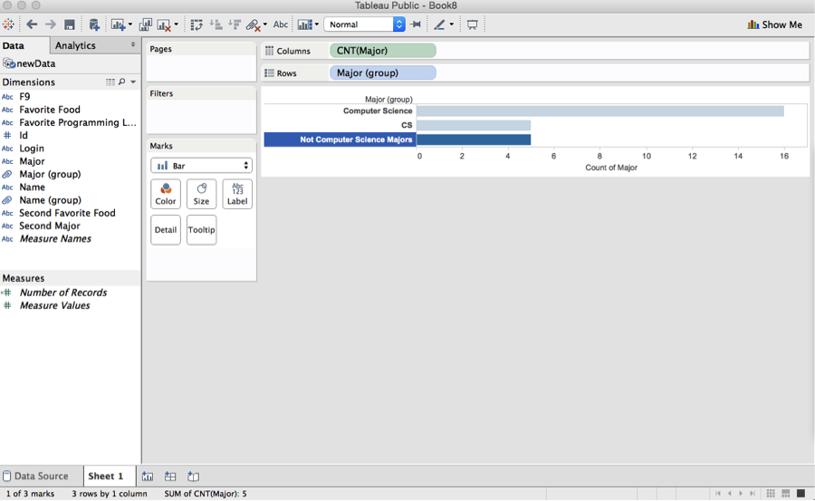
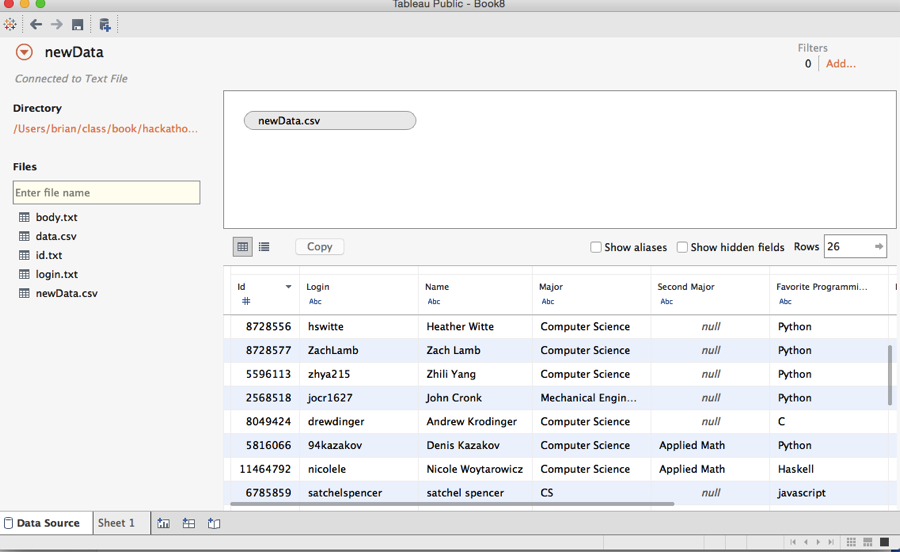

# Tableau Visualization

Tableau is arguably the biggest deal now in terms of data visualization for non-programmers.
Let's pretend you are not a programer. Learn and experience what it is like to make
visualizations using Tableau to answer the same questions about your classmates in our course.

For each of the question, think about what chart you should use to convey your answer and
make your best effort to create something that makes sense to you. There's no right
or wrong. When we meet in the class again, we will set aside time for each team to discuss
and compare the variety of visualization solutions each member has come up with for the
same set of questions. It will be fun!

To include a Tableau visualization in your report, take a screenshot, save it as an image,
put it in the `learning/week2` folder, and replace ``  with
your own image. Please makes sure your screenshot includes the _entire_ Tableau interface
including the controls, widgets ...etc.

# How big the deal Tableau really is?

Tableau has 26,000 customers as of 2014 according to Forbes Magazine
http://www.forbes.com/sites/greatspeculations/2015/04/15/a-closer-look-at-tableaus-customer-base-growth/

Tableau clocked the fastest sales growth, 84 percent, of any leading business analytics company last year, according to researcher IDC.
http://www.bloomberg.com/bw/articles/2014-12-11/high-demand-for-chartmaking-software-boosts-qlik-and-tableau

# How many of the students are CS majors?

Look for the count for the group of Compuer Science, this is the students who listed CS or Computer Science as majors

# How many peoples names start with A?

The students by name are listed and all the students whos names starts with A have been place in a group.

# How many of the students are not CS majors?

All the majors that are not CS have been put into a group

# What is the user id for the login zhya215?

You just have to look at the data here, no special formatting is needed
