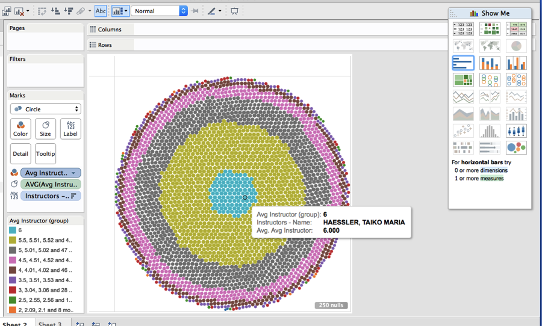

# Visualization

Using Tableau, create visualization for each question in the report. You will
work on this independently just like last week.

To include a Tableau visualization in your report, take a screenshot, save it as an image,
put it in the `learning/week2` folder, and replace ``  with
your own image. Please makes sure your screenshot includes the _entire_ Tableau interface
including the controls, widgets ...etc.

# Import

Data: [fcq.clean.json](https://github.com/bigdatahci2015/book/blob/master/hackathons/fcq/fcq.clean.json)



(a copy of this file is in your book repository already in the directory `hackathons/fcq`)

This dataset is provided to you in the JSON format. Your first task is to figure out
how to transform this JSON file into a format that can be fed into Tableau. As
a junior and senior, you are expected to be able to look around the Internet
to problem solve.

# How many courses in IPHY that has 4 credits hours ? by Fadhil


var iphy = _.filter(data,function(n){
        return n.CrsPBADept == 'IPHY'
})
var fours = _.filter(iphy,function(n){
        return n.Hours == 4
})
var fours = fours.length

return  fours


There are {{result}} courses in IPHY with 4 credit hours

The graph shows the number of IPHY classes with each amount of credit hours. 

# Which are the top 5 departments in terms of number of 4000 level classes?
# by Brian


var groups = _.groupBy(data,function(n){
        return n.Subject
})
var subject4k = _.mapValues(groups,function(n){
        var  classLvl = _.pluck(n,"CrsLvlNum")
        classes4k = _.filter(classLvl,function(n){
                return n == "4XXX"
        })
        return  classes4k.length
})
var sort4k = _.sortBy(subject4k, function(n,key){
        return n
})
// Problem is the the sort removed the keys
// so use the sort to find the 5th highest vailue
// then go back to dictionary and pull the ones that size or larger
var cutoff = sort4k[sort4k.length-5]
var top54k = _.pick(subject4k,function(n){
        return n >= cutoff
})
var result = top54k
return result


<table>

    <tr>
        <td>{{key}}</td>
        <td>{{value}}</td>
    </tr>

</table>

There is a tie for the 5th spot so there are six departments with the five highest number of 4000 level classes as shown in the bar chart.

# Which instructors course has the highest enrollment?
# by Zhili


var groups = _.groupBy(data,function(n){
        return n.Instructors[0].name
})
var enrolls = _.pluck(data,"N.ENROLL")
var biggest = _.max(enrolls)
var bigClass = _.pick(data,_.matchesProperty('N.ENROLL',biggest))

var prof =  _.pluck(bigClass, "Instructors")
var prof = _.pluck(prof[0],'name')
return prof


The instructor of the course with the highest enrollment is {{result}}

The bar chart shows by Intsructor and class which Instructros class has the highest enrollments.

#  Which department has the highest enrollment? By Tristan



var groups = _.groupBy(data,function(n){
        return n.Subject
})
var enrollments = _.mapValues(groups,function(n){
        var enrollArray = _.pluck(n,'N.ENROLL')
        var sum = _.sum(enrollArray)
        return sum
})
var numbers = _.max(enrollments)
var bigDept = _.findKey(enrollments,function(n){
        return n >= numbers
})
return bigDept


The department with the biggest enrollment is {{result}}

#  What instructors have the highest rating? By Andrew


var groups = _.groupBy(data,function(n){
        return n.Instructors[0].name
})
var ratings = _.pluck(data,"AvgInstructor")
var best = _.max(ratings)
var bestProf = _.pick(data,_.matchesProperty('AvgInstructor',best))

var prof =  _.pluck(bestProf, "Instructors")
prof = _.flatten(prof)
var prof = _.pluck(prof,'name')
return prof


The instructors with the highest rating are

<table>

    <tr>
        <td>{{x}}</td>
    </tr>

</table>

This one was difficult as there are many instructors with a top rating of 6. The first chart show graphically the distribution by rating with ratings divided into groups -- 6 then 5.5-5.99, etc in steps of .5 so that you can see the distributions of ratings.
The bar chart shows a number of names of instructors who have a rataing of six but there was no way to create a chart with all the names that would fit into one screen shot.

